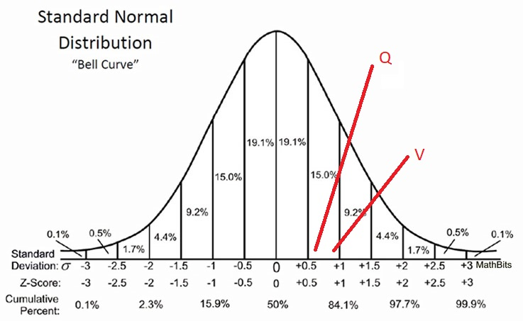

```{r setup, include=FALSE}
knitr::opts_chunk$set(echo = TRUE)
setwd("C:/Users/iGuest/Desktop/University of Washington/Quarter 2/INFX 573/Assignments/Assignment 1")

library(dplyr)
library(ggplot2)
library(pander)
data <- read.csv("FelixHernandez2015.csv", stringsAsFactors=FALSE)
data2 <- read.csv("RandyJohnson1995.csv", stringsAsFactors=FALSE)
```

## Question 1

### A 2012 Pew Research survey asked 2,373 randomly sampled registered voters their political affiliation (Republican, Democrat, or Independent) and whether or not they identify as swing voters. 35% of respondents identified as Independent, 23% identified as swing voters, and 11% identified as both.

```{r}
total <- 2373
both <- 0.11
independent <- 0.35
swing <- 0.23
```
a. No, they are not mutually exclusive since 11% of the respondents sad that they are Independent affiliates and also swing voters

b. `r (independent-both)*100` % of voters are independent but not swing.

c. `r (independent+swing-both)*100` % of voters are either independent or swing.

d. `r (1-(independent+swing-both))*100` % of voters are neither swing nor independent.

e. Since we do not know the number of people who might be Independent and swing, we cannot say that for sure. The event might be independent, it might not be.

## Question 2

### Exploratory Data Analysis

### How many wins does Felix have this year?

```{r}
data <- read.csv("FelixHernandez2015.csv", stringsAsFactors=FALSE)
data2 <- read.csv("RandyJohnson1995.csv", stringsAsFactors=FALSE)
```

```{r }
pander(sum(data$W))
```

### What is the mean, median, and mode number of strikeouts Felix threw over the 2015 season?

```{r}
mode <-function(x) 
{
  ux <-unique(x)
  ux[which.max(tabulate(match(x, ux)))]
}

pander(mean(data$SO))
pander(median(data$SO))
pander(mode(data$SO))
```

### Plot the relationship between innings pitched and strikeouts and between innings pitched and walks (base on balls). Describe the patterns you see

```{r fig.width=5, fig.height=2.5}
ggplot(data, aes(x = data$IP, y = data$SO)) + geom_histogram() + xlab('No. of Innings') + ylab('No. of strikeouts')
```

As we can see in the above figure, it signifies a slightly increasing relationship between innings played and the number of strikouts.

```{r fig.width=5, fig.height=2.5}
ggplot(data, aes(x = data$IP, y = data$BB)) + geom_point() + xlab('No. of Innings') + ylab('No. of walks')
```

As we can see in the above figure, it signifies a slightly decreasing relationship between innings played and the number of walks.

### Calculate the correlation coefficient between innings pitched and strikeouts and between innings pitched and walks. Do these align with what you saw in the plots?

Correlation coefficient between innings pitched and strikeouts:

```{r}
corel.innings_strikeouts <- cor(data$IP, data$SO)
pander(corel.innings_strikeouts)
```

Correlation coefficient between innings pitched and walks:


```{r}
corel.innings_walks <- cor(data$IP, data$BB)
pander(corel.innings_walks)
```

As we can observe, the correlation coefficients of both the relationships align with what we saw in the graphs.

### Calculate the mean and variance of walks by month. Do you see changing mean walks over time? What about the variability over time? What might the pattern mean?

```{r}
pander(by(data$BB, data$Month, mean))
```


We can observe from the above data that there might be a seasonal pattern affected by their opponents or that the unusually high average walks in September might be an anomaly.

### Does Felix win more on the road or at home? 

```{r}
wins.athome <- count(filter(data, data$W==1, data$away==0))
pander(as.integer(wins.athome))
wins.ontheroad <- count(filter(data, data$W==1, data$away==1))
pander(as.integer(wins.ontheroad))
```

We can see from the above results that Felix does win more at home.

### Load the other data set containing similar records for Randy Johnson in 1995. Does Randy Johnson outperform Felix in terms of strikeouts across the 1995 season?

```{r}
pander(sum(data$SO))
pander(sum(data2$SO))
```

Yes, as we can see from the above results, Randy Johnson does outperform Felix Hernandez by 294 to 191 strikeouts.


## Question 3

### Distributions 

### Sophia who took the Graduate Record Examination (GRE) scored 156 on the Verbal Reasoning section and 157 on the Quantitative Reasoning section. The mean score for Verbal Reasoning section for all test takers was 151 with a standard deviation of 7, and the mean score for the Quantitative Reasoning was 153 with a standard deviation of 7.67. Suppose that both distributions are nearly normal.


```{r results='hide'}
vscore <- 156
vsdev <- 7
vmean <- 151
qscore <- 157
qsdev <- 7.67
qmean <- 153
verbz <- (vscore-vmean)/vsdev
quanz <- (qscore-qmean)/qsdev
vz <- pnorm(verbz)
qz <- pnorm(quanz)

```
a. Sophia's z-score on the verbal reasoning section was `r verbz` and on the quantitative section it was `r quanz`

b. In the curve shown in Figure 1, v represents Sophia's z-score on the verbal section while Q represents Sophia's z-score on the quantitative section.



c. As we can see from the above results, Sophia's z-score in Verbal Reasoning is slightly better than in Quantitative hence she did better on the Verbal Reasoning section.

d. Sophia's percentile in Verbal is `r vz*100` and in Quantitative it is `r qz*100`.

e. `r (1-vz)*100` % of test takers did better than her in Verbal and `r (1-qz)*100` % of test takers did better than her in Quantitative section.

f. By just looking at her raw scores we would have concluded that she performed better in the quantitative section but if we look at the percentile scores, she relatively did better in the verbal reasoning section since less number of test takers got higher marks than her in that section.